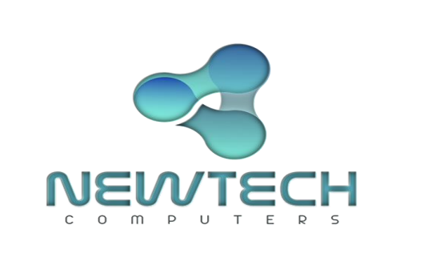
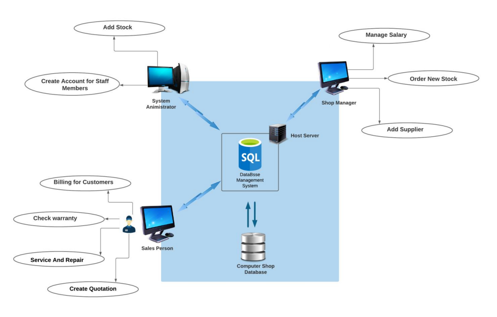
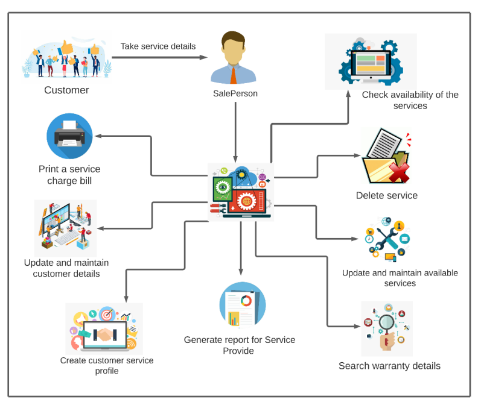
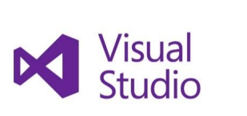
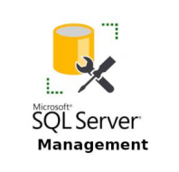

<!-- PROJECT LOGO -->
 

  
  <h3 align="center">Computer Shop Management System </h3>

  

    <a href="https://www.sliit.lk/"><strong>Sri Lanka Institute of Information Technology</strong></a>
     
    IT2080 - Information Technology Project
     
     
    <a href="#"> Group ITP2021_S2_B04_G09 </a>
     
    Group Project
          
  

<!-- ABOUT THE PROJECT -->
### Project Discription
New Tech computers’ is a shop which sells computer & accessories. They sell various technical 
products such as computers, computer parts and services. The shop was establish in 2019. This is a shop 
which still use a manual system to control the shop. They have so many local and international supplier 
community who supply a good amount of quality products. New Tech computers still owns only one branch
located in Galle, Sri Lanka. They are planning to launch a new branch of their shop in near future. There are 
several people who work here, such as company manager, sales person, some technicians, clerks to handle 
the data and billing people. Through this shop you can acquire so many quality technical equipment with a
attractive warranty period.
When we were analyzing the requirements of client. We made a decision to develop a Desktop 
Application. According to this proposal, we will be discussing about the problems and difficulties they face, the 
best solutions that we can give, and all the benefits they can get using this computer shop management 
system

### Solution to the above problem
- The desktop application provides new automated system to manage finance, stock, supplier details, 
quotations, orders, customer repairs and staff’s accounts. 
- Using this system “NewTech” Computers can maintain their database to store, update and delete data.
- By stock management function Administrator can view unavailable stocks in the shop and restock 
those items easily.
- By service repair function, the shop can provide services and repairs for the customers as soon as 
possible.
- By maintaining database, there is no data duplication.
- The desktop application gives more professional aspects to the “NewTech” Computers

## System Overview 

### Service repair and Warranty claims Function Details 

This repository contains the implementation of the Service and Warranty Claims system for NewTech Company. The system allows salespersons to manage service details and warranty claims for electronic equipment repair.

#### Function Description

The system provides the following functionalities:

- Salesperson Responsibilities:
  - Adding Service Details: Salespersons can enter service details and customer information into the system.
  - Checking Service Availability: Salespersons can retrieve service details from the database to determine service availability.
  - Updating Service Details: Salespersons are responsible for updating and maintaining available services in the system. They can make changes to the services provided and delete services that are no longer available.
  - Warranty Search: Salespersons can search for warranty details corresponding to the service item purchased by the customer.
  - Adding Customer Service: Salespersons create and add customer's current service to the system. They update and maintain service details based on the customer's service history.
  - CRUD Operations: Salespersons can perform Create, Read, Update, and Delete operations for managing service details.
- Service Charge Billing: After providing the service, salespersons generate service charge bills for customers. Payments are made at the sales counter to retrieve the repaired item.
- Service Provided Report: Salespersons generate a service provided report, which provides valuable insights for NewTech Company to make future decisions based on the current situation.

#### Special Features

- Database Integration: The system integrates with a database to store and retrieve service details, warranty information, and customer data.
- CRUD Operations: The system allows salespersons to perform Create, Read, Update, and Delete operations for efficient management of service details.
- Service Charge Billing: The system generates service charge bills, streamlining the payment process for customers.
- Service Provided Report: The system generates comprehensive reports that assist NewTech Company in making informed decisions.

<!-- TECHNOLOGY -->
## Development Environment and Programming Language

This project utilizes the following development environment and programming language:

### Visual Studio

- Visual Studio is a widely used integrated development environment (IDE) for developing websites, desktop applications, web apps, and more.
- It is developed by Microsoft and provides a comprehensive set of tools and features for efficient application development.

### SQL Server Management Studio

- SQL Server Management Studio (SSMS) is an application developed by Microsoft for configuring, managing, and administering all components within Microsoft SQL Server.
- It serves as a powerful tool for database administrators and developers to interact with SQL Server databases.

### C#

- C# (pronounced "C sharp") is a popular programming language known for its use of object-oriented concepts.
- It is utilized in the development of web apps, desktop applications, and web services.
- C# produces output files in the form of EXE (executable) or DLL (dynamic-link library).

<!-- ACKNOWLEDGMENTS -->

## Acknowledgment
🚀 Thank all SLIIT Lectures and who helps to develope and understand this project

